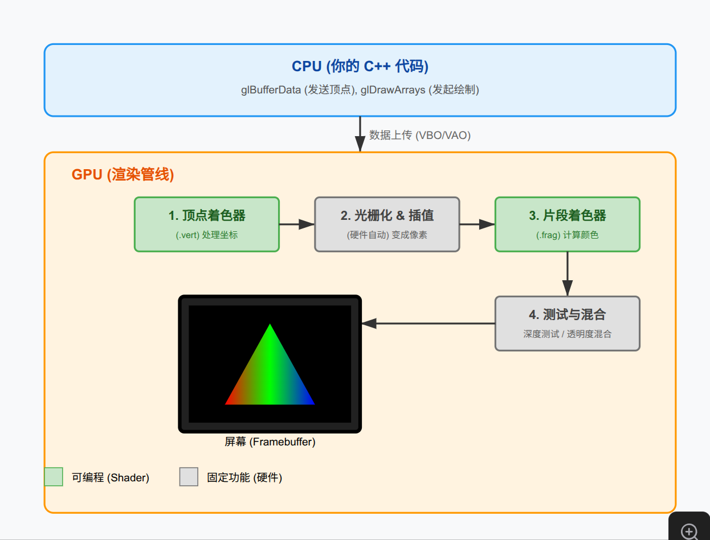

## 代码规范

# MyIndieProject 代码规范 (Code Style Guide)

## 1. 目录与文件结构

* **原则**：物理结构（文件夹）应严格对应逻辑结构（命名空间）。
* **头文件 (.h)**：必须包含 `#pragma once`。
* **包含顺序**：
  1. 对应的头文件 (如 `GameApp.cpp` 第一行是 `#include "GameApp.h"`)
  2. 本项目其他模块 (`#include "Platform/..."`)
  3. 第三方库 (`#include <glad/glad.h>`, `#include <glm/...>`)
  4. 标准库 (`#include <iostream>`, `#include <vector>`)

## 2. 命名约定 (Naming Convention)

| 类型                      | 规则            | 示例                              | 说明                 |
| :------------------------ | :-------------- | :-------------------------------- | :------------------- |
| **类/结构体**       | PascalCase      | `GameApp`, `BatchRenderer`    | 大驼峰               |
| **函数/方法**       | PascalCase      | `Update()`, `CompileShader()` | 大驼峰，动词开头     |
| **变量 (局部)**     | camelCase       | `vertexSource`, `windowWidth` | 小驼峰               |
| **变量 (成员)**     | m_PascalCase    | `m_RendererID`, `m_Window`    | `m_` 前缀 + 大驼峰 |
| **变量 (静态成员)** | s_PascalCase    | `s_Instance`                    | `s_` 前缀          |
| **常量/宏**         | SCREAMING_SNAKE | `MAX_SPRITES`, `PI`           | 全大写 + 下划线      |
| **命名空间**        | PascalCase      | `MyEngine`, `Client`          | 避免缩写             |

特例： 对于大写缩写（如 `VAO` 或 `JSON`），在类名中保持大写（`JSONParser`），在变量名中视为单词处理（`jsonParser`）。
变量 (Public Struct 成员) | PascalCase | Position, Color | 仅限 POD 结构体
## 3. 现代 C++ 特性 (Modern C++ Usage)

我们强制使用 **C++17** 标准。

* **内存管理**：

  * **严禁**在业务逻辑中使用裸指针 (`new`/`delete`)。
  * **必须**使用智能指针：
    * 独占资源用 `std::unique_ptr` (如 `m_Window`, `m_Shader`)。
    * 共享资源用 `std::shared_ptr` (如未来的 `Texture`, `Material`)。
  * *例外*：底层封装（如 `Window` 内部调用 GLFW）或观察者模式（传递 `Window*` 给 Input）可以使用裸指针，但不负责销毁。
* **关键字**：

  * 虚函数重写必须加 `override`。
  * 不修改成员变量的函数必须加 `const` (如 `IsKeyPressed`, `GetWidth`)。
  * 构造函数若只有一个参数，尽量加 `explicit` 防止隐式转换。

## 4. 类设计规范 (Class Design)

* **RAII (资源获取即初始化)**：

  * 类的构造函数负责申请资源（如 `glGenBuffers`）。
  * 类的析构函数负责释放资源（如 `glDeleteBuffers`）。
  * 禁止出现资源泄漏。
* **Pimpl (可选)**：对于依赖复杂的底层实现（如包含大量 OpenGL 头文件），尽量在 `.cpp` 中实现细节，保持 `.h` 干净。

## 5. 渲染与数学

* **数学库**：统一使用 **GLM**。
  * 向量：`glm::vec2`, `glm::vec3`, `glm::vec4`
  * 矩阵：`glm::mat4`
* **OpenGL 调用**：
  * 禁止在 `GameApp` 等高层逻辑中直接调用 `glDrawArrays` 等原生 API。
  * 必须通过 `Renderer` 或 `Shader` 等封装类进行调用。

## 6. 注释与文档

* **头文件注释**：解释“这个类是干什么的”。
* **方法注释**：如果逻辑复杂，解释“为什么这么做”，而不是“做了什么”（代码本身就是解释）。
* **TODO**：使用 `// TODO: 说明` 标记待办事项。

## 7. 类型转换 (Type Casting)

* 严禁使用 C 风格转换 (type)value。
* 必须根据意图使用 C++ 转换：
    * static_cast: 用于良性转换（如 float 转 int，子类转父类）。
    * reinterpret_cast: 用于低级位操作（如 long 转 void*，OpenGL offset 处理）。
    * const_cast: 尽量避免，除非对接遗留库。
    * dynamic_cast: 尽量避免（性能开销大），仅在工具层使用。
---

### 示例代码片段

```cpp
// src/Platform/OpenGL/Texture.h

#pragma once

#include <string>
#include <memory>

// 命名空间（可选，视项目规模定）
namespace MyEngine {

    class Texture {
    public:
        // 构造函数：加载纹理
        explicit Texture(const std::string& path);
        ~Texture();

        // 绑定到指定槽位
        void Bind(unsigned int slot = 0) const;

        // Getters
        int GetWidth() const { return m_Width; }
        int GetHeight() const { return m_Height; }

    private:
        unsigned int m_RendererID;
        std::string m_FilePath;
        int m_Width, m_Height, m_BPP; // BPP = Bytes Per Pixel
    };

}
```

记录好这份规范后，我们就可以在接下来的 `BatchRenderer` 开发中严格执行它，写出漂亮、健壮的代码了。

MyIndieProject/
├── CMakeLists.txt                  # 顶层构建脚本
├── assets/                         # 【资源目录】
│   ├── engine/                     # >> 引擎内置资源 (不可删除)
│   │   ├── shaders/                # 核心着色器库
│   │   │   ├── include/            # GLSL 头文件 (被其他 shader include)
│   │   │   │   ├── common.glsl     # 通用数学函数
│   │   │   │   └── lighting.glsl   # 光照计算公式
│   │   │   ├── core_sprite.vs      # 2D 精灵顶点着色器
│   │   │   ├── core_sprite.fs      # 2D 精灵片段着色器
│   │   │   ├── core_pbr.vs         # 3D 标准物理渲染顶点
│   │   │   ├── core_pbr.fs         # 3D 标准物理渲染片段
│   │   │   └── core_ui.fs          # UI 渲染专用
│   │   └── textures/               # 默认纹理 (如纯白图片、缺失材质紫黑格)
│   └── game/                       # >> 具体游戏资源
│       ├── textures/
│       └── shaders/                # 游戏特有的特殊着色器 (可选)
├── src/
│   ├── Common/                     # 【公共数据层】
│   │   ├── DataTypes.h             # u8, u32, f32 等类型定义
│   │   └── Math/                   # 向量、矩阵库封装
│   ├── Engine/                     # 【引擎核心层】(编译为静态库 EngineLib)
│   │   ├── Core/
│   │   │   ├── Application.h       # 引擎生命周期管理
│   │   │   ├── Logger.h            # 日志
│   │   │   └── FileSystem.h        # 跨平台文件读取
│   │   ├── Render/                 # >> 渲染核心 <<
│   │   │   ├── Backend/            # OpenGL/Vulkan API 隔离层
│   │   │   │   ├── OpenGLBuffer.cpp
│   │   │   │   └── OpenGLTexture.cpp
│   │   │   ├── Shader/             # >> 着色器系统 <<
│   │   │   │   ├── Shader.h        # 单个 Shader Program 的封装
│   │   │   │   ├── ShaderLibrary.h # Shader 管理器 (单例)
│   │   │   │   └── ShaderParser.h  # 解析 #include 等预处理指令
│   │   │   ├── Material/           # >> 材质系统 <<
│   │   │   │   ├── Material.h      # 材质基类 (持有 Shader 引用)
│   │   │   │   └── MaterialInstance.h # 材质实例 (持有具体参数)
│   │   │   └── Renderer2D.h        # 2D 批处理渲染器
│   │   └── Platform/               # 窗口与输入 (GLFW)
│   ├── Server/                     # 【服务端逻辑】
│   │   └── ... (同前文)
│   └── Client/                     # 【客户端表现】
│       ├── GameApp.cpp             # 客户端入口
│       ├── Gameplay/               # 游戏逻辑
│       │   ├── PlayerController.cpp
│       │   └── LevelRenderer.cpp   # 关卡渲染
│       └── Resources/              # 客户端资源句柄
└── vendor/                         # 第三方库 (GLAD, GLFW, GLM, stb_image)

工作量评估
假设你是一名有一定 C++ 基础的开发者，每天投入 2-3 小时：

基础搭建 (Window + OpenGL Context): 1-2 天
资源加载 (Texture/Shader/Audio): 3-5 天
核心渲染器 (Batch Renderer - 关键): 1-2 周
文字渲染 (Font): 1 周 (这是最繁琐的部分之一)
输入与基础UI: 3-5 天
调试与跨平台适配: 持续进行
总计：约 1 到 1.5 个月，你就能拥有一个属于自己的、能跑通游戏逻辑的“微型引擎”。

如何实现？（核心路线图）
Raylib 的核心魔力在于它把复杂的 OpenGL 状态机封装成了简单的立即模式 (Immediate Mode) 函数（如 DrawTexture）。你需要做的就是实现这一层封装。

我们需要站在巨人的肩膀上，不要从零写驱动代码。请使用以下 "黄金四件套"：

GLFW: 搞定窗口和输入 (Windows/Linux)。
GLAD: 加载 OpenGL 函数指针。
stb_image: 加载 png/jpg (单头文件)。
glm: 数学库。

MyIndieGame/
├── src/
│   ├── Platform/           # 【底层封装】(你的 Raylib 替代品)
│   │   ├── Window.cpp      # GLFW 封装
│   │   ├── Input.cpp       # 键盘鼠标
│   │   ├── OpenGL/         # 图形 API
│   │   │   ├── Shader.cpp
│   │   │   ├── Texture.cpp
│   │   │   └── BatchRenderer.cpp # 核心！
│   │   └── Audio/          # MiniAudio 封装
│   │
│   ├── Engine/             # 【中间层】
│   │   ├── ResourceManager.h
│   │   ├── Camera.h
│   │   └── Timer.h
│   │
│   └── Game/               # 【游戏逻辑】(这里写起来就像用 Raylib 一样)
│       ├── Player.cpp
│       └── World.cpp

如果你采纳 Raylib，你的架构压力会瞬间减小 80%。你不再需要写 Engine/Render/Backend，也不用管 Engine/Platform

太棒了！Linux 是开发底层系统和游戏引擎的绝佳环境（也是服务器部署的目标环境）。在 Linux 下开发 C++ 游戏引擎通常比 Windows 更顺滑，因为工具链（Toolchain）更统一。

这是针对 **Linux (Ubuntu/Debian/Arch)** 的详细清单。

---

### 📦 第一部分：系统包安装清单 (System Packages)

在 Linux 上，你不需要去各个官网下载安装包，直接用包管理器（apt/pacman）安装即可。

打开终端，运行以下命令（以 Ubuntu/Debian 为例）：

#### 1. 基础编译工具链

```bash
sudo apt update
sudo apt install build-essential gdb cmake git
```

* **build-essential:** 包含了 `gcc`, `g++`, `make` 等核心编译工具。
* **gdb:** 调试器。
* **cmake:** 构建系统。

#### 2. 图形库依赖 (GLFW 依赖)

GLFW 在 Linux 上需要依赖 X11 或 Wayland 的开发库。

```bash
sudo apt install libglfw3-dev
```

* **libglfw3-dev:** 这会直接安装 GLFW 的头文件和静态库。你甚至不需要自己下载源码编译它（虽然自己编译更灵活，但初期直接用 apt 安装最省事）。
* *如果后续编译报错缺库，可能还需要安装这些 X11 相关的库：*

  ```bash
  sudo apt install libx11-dev libxrandr-dev libxinerama-dev libxcursor-dev libxi-dev
  ```

#### 3. IDE / 编辑器

* **推荐：** **VS Code** (轻量，插件丰富)
  * 安装插件：`C/C++` (Microsoft), `CMake Tools` (Microsoft)。
* **硬核推荐：** **CLion** (JetBrains)
  * 收费（学生免费），但对 CMake 和 C++ 的支持是业界最强的。
* **极简推荐：** **Vim / Neovim** (如果你习惯终端操作)。

---

### 📚 第二部分：项目库清单 (Vendor Libraries)

和 Windows 一样，这些库建议以源码形式放在你的 `vendor/` 目录下，或者使用 Git Submodule。

1. **GLAD:** (必须手动生成)

   * 去 [glad.dav1d.de](https://glad.dav1d.de/) 生成并下载 `glad.c` 和头文件。
   * 放到 `vendor/glad/`。
2. **GLM:** (Header-only)

   * `sudo apt install libglm-dev` (可以直接装系统里)
   * 或者下载源码放到 `vendor/glm/` (推荐，保证版本可控)。
3. **stb_image:** (Header-only)

   * 下载 `stb_image.h` 放到 `vendor/stb/`。

---

### 🛠️ 第三部分：CMake 配置 (Linux 特有)

在 Linux 下，你的 `CMakeLists.txt` 链接库的方式会稍微简单一点，因为系统路径里通常已经有了。

**示例 `CMakeLists.txt` 片段：**

```cmake
cmake_minimum_required(VERSION 3.10)
project(MyIndieGame)

# 设置 C++ 标准
set(CMAKE_CXX_STANDARD 17)

# 1. 查找系统里的 GLFW (如果是 apt 安装的)
find_package(glfw3 3.3 REQUIRED)

# 2. 包含 GLAD 和 GLM (假设在 vendor 下)
include_directories(vendor/glad/include)
include_directories(vendor/glm)
include_directories(vendor/stb)

# 3. 添加 GLAD 的源文件
add_library(glad vendor/glad/src/glad.c)

# 4. 你的游戏可执行文件
add_executable(Game src/main.cpp src/Window.cpp ...)

# 5. 链接库
# Linux 下必须显式链接 OpenGL 库 (GL), 线程库 (pthread), 时间库 (dl)
target_link_libraries(Game 
    PRIVATE 
    glad 
    glfw 
    GL          # 系统 OpenGL 驱动
    dl          # 动态链接加载器
    pthread     # 多线程支持 (C/S架构必须)
)
```

---

### 🧠 第四部分：Linux 下的学习重点

除了之前提到的 OpenGL 和 C++，在 Linux 下开发你需要额外了解：

1. **Make / Ninja:**

   * CMake 生成的是 `Makefile`。你需要知道在终端敲 `make` 来编译。
   * 或者用 `ninja` (速度更快)：`sudo apt install ninja-build`，然后 `cmake -G Ninja ..`。
2. **调试 (GDB / VS Code):**

   * 在 Linux 下没有 Visual Studio 那种傻瓜式调试器。
   * 你需要学会配置 VS Code 的 `.vscode/launch.json` 来启动 GDB 调试你的程序。
3. **显卡驱动:**

   * 确认你的 Linux 显卡驱动装好了。运行 `glxinfo | grep "OpenGL version"` 看看是不是显示了正确的版本（比如 4.6），而不是 Mesa 软件渲染。

### 🚀 你的第一步 (Linux 版)

1. 打开终端，安装 `build-essential`, `cmake`, `libglfw3-dev`。
2. 创建一个文件夹 `MyGame`。
3. 创建一个 `main.cpp`，写一个简单的 Hello World。
4. 创建一个 `CMakeLists.txt`。
5. 运行：
   ```bash
   mkdir build
   cd build
   cmake ..
   make
   ./MyGame
   ```
6. 如果打印出 Hello World，环境就通了！接下来引入 GLFW 画窗口。




这张图展示了从你的 C++ 代码到屏幕显示的完整流程。请注意**绿色**的部分是你可以写代码控制的（Shader），**灰色**的部分是显卡硬件自动完成的。

**总结：**
你写的 GLSL -> 传给 OpenGL API -> 显卡驱动接收 -> **驱动内置编译器编译** -> GPU 机器码 -> 在显卡上运行

GLSL (OpenGL Shading Language) 的语法 **非常像 C 语言** ，但它是专门为数学计算和图形处理“魔改”过的。

**核心特点：**

1. **强类型：** 必须声明类型，不能随便混用（比如 `int` 不能直接赋值给 `float`，必须强转）。
2. **内置数学类型：** 这是它最强大的地方。它原生支持向量和矩阵运算。
   * `vec2`, `vec3`, `vec4`: 2/3/4维向量（比如坐标、颜色）。
   * `mat2`, `mat3`, `mat4`: 2x2, 3x3, 4x4 矩阵。
3. **并行思维：** 没有 `printf`，没有 `cin`。你的代码是同时在几千个核心上跑的。

```glsl
// --- 变量定义 ---
int  i = 10;
float f = 3.14;
bool b = true;

// --- 向量 (Vector) ---
vec3 pos = vec3(1.0, 2.0, 3.0);
vec3 color = vec3(1.0, 0.0, 0.0); // 红色

// 向量极其灵活的访问方式 (Swizzling)
float x = pos.x;      // 取第1个分量
vec2 xy = pos.xy;     // 取前2个分量，变成一个 vec2
vec3 c = color.bgr;   // 甚至可以乱序取！变成 (0, 0, 1) 蓝色

// --- 矩阵 (Matrix) ---
mat4 projection; // 4x4 投影矩阵

// --- 输入输出修饰符 ---
in  vec3 vPos;   // 输入：从上一阶段传进来的
out vec4 fColor; // 输出：传给下一阶段的
uniform float uTime; // 全局变量：CPU 传进来的，对所有像素都一样

// --- 函数 ---
// 有 main 函数作为入口
void main() {
    // 内置数学函数极多
    float d = distance(pos, vec3(0.0)); // 计算距离
    float s = sin(uTime);               // 正弦
    vec3 n = normalize(pos);            // 归一化
}

```

没问题，我们用**修正后的、符合最高规范的代码**，重新梳理一遍这一章。

---

# 阶段二（下）：批处理渲染器 (Batch Renderer) —— 重制版

这是 2D 引擎性能的分水岭。
如果不做批处理，画 10,000 个精灵需要调用 10,000 次 DrawCall，FPS 会是个位数。
做了批处理，画 10,000 个精灵只需要 1 次 DrawCall，FPS 依然跑满 60+。

### 核心思想：公交车理论
我们需要构建一个**缓冲区 (Buffer)**，像公交车一样。
1.  **上车 (`DrawQuad`)**：当游戏逻辑想画一个图时，不要立刻画，而是把它的坐标、颜色塞进这个缓冲区。
2.  **发车 (`Flush`)**：当缓冲区满了，或者这一帧结束了，把整车数据一次性发给 GPU 绘制。

---

### 1. 定义数据结构

我们需要在 `src/Platform/OpenGL/` 下新建 `BatchRenderer.h` 和 `BatchRenderer.cpp`。

首先设计头文件。我们需要定义“一个顶点长什么样”。

#### `src/Platform/OpenGL/BatchRenderer.h`

```cpp
#pragma once

#include <glm/glm.hpp>
#include <memory>
#include <vector>

// 规范修正：POD (Plain Old Data) 结构体成员使用 PascalCase
struct Vertex {
    glm::vec3 Position;
    glm::vec4 Color;
    // 未来还会加: glm::vec2 TexCoords; float TexIndex;
};

// 统计信息结构体
struct RendererStats {
    uint32_t DrawCalls = 0;
    uint32_t QuadCount = 0;
};

class BatchRenderer {
public:
    // 初始化渲染器 (创建 VAO/VBO，分配内存)
    static void Init();
    
    // 关闭渲染器 (清理资源)
    static void Shutdown();

    // --- 绘制命令 ---
    
    // 开始新的一批绘制 (重置指针)
    static void BeginBatch();
    
    // 结束当前批次 (将数据上传 GPU 并绘制)
    static void EndBatch();
    
    // 提交一个矩形到队列中
    static void DrawQuad(const glm::vec2& position, const glm::vec2& size, const glm::vec4& color);

    // 获取统计数据
    static RendererStats GetStats();
    static void ResetStats();

private:
    // 实际执行绘制的内部函数
    static void Flush();
};
```

---

### 2. 实现核心逻辑 (Modern C++ 版)

这个 `.cpp` 文件是引擎中最精密的部分之一。我们使用 `std::unique_ptr` 管理内存，同时使用 `glMapBuffer` 保证极致性能。

#### `src/Platform/OpenGL/BatchRenderer.cpp`

```cpp
#include "BatchRenderer.h"
#include <glad/glad.h>
#include <array>

// --- 配置常量 ---
// 10,000 个矩形 = 40,000 个顶点。现代 GPU 即使每帧传这也毫无压力。
const size_t MAX_QUADS = 10000;
const size_t MAX_VERTICES = MAX_QUADS * 4;
const size_t MAX_INDICES = MAX_QUADS * 6;

// --- 内部数据存储 ---
struct RendererData {
    GLuint VAO = 0;
    GLuint VBO = 0;
    GLuint EBO = 0; // 索引缓冲

    // CPU 端的顶点缓冲区
    // 使用 unique_ptr 自动管理内存生命周期 (RAII)
    std::unique_ptr<Vertex[]> QuadBufferBase;
    
    // 游标指针：用于快速写入数据。它是“观察者”，不拥有内存，所以用裸指针。
    Vertex* QuadBufferPtr = nullptr;

    uint32_t IndexCount = 0;
    RendererStats Stats;
};

// 静态单例数据
static RendererData s_Data;

void BatchRenderer::Init() {
    // 1. 在 CPU 端分配内存 (使用 make_unique，安全且符合规范)
    s_Data.QuadBufferBase = std::make_unique<Vertex[]>(MAX_VERTICES);

    // 2. 创建 OpenGL 对象
    glGenVertexArrays(1, &s_Data.VAO);
    glBindVertexArray(s_Data.VAO);

    // VBO (顶点缓冲)
    glGenBuffers(1, &s_Data.VBO);
    glBindBuffer(GL_ARRAY_BUFFER, s_Data.VBO);
    // 关键：GL_DYNAMIC_DRAW，因为数据每帧都会变
    glBufferData(GL_ARRAY_BUFFER, MAX_VERTICES * sizeof(Vertex), nullptr, GL_DYNAMIC_DRAW);

    // 设置顶点属性布局
    // 属性 0: Position (vec3)
    glEnableVertexAttribArray(0);
    glVertexAttribPointer(0, 3, GL_FLOAT, GL_FALSE, sizeof(Vertex), (const void*)offsetof(Vertex, Position));
    
    // 属性 1: Color (vec4)
    glEnableVertexAttribArray(1);
    glVertexAttribPointer(1, 4, GL_FLOAT, GL_FALSE, sizeof(Vertex), (const void*)offsetof(Vertex, Color));

    // EBO (索引缓冲) - 预计算所有的索引
    // 使用 unique_ptr 暂存索引数组
    auto indices = std::make_unique<uint32_t[]>(MAX_INDICES);
    uint32_t offset = 0;
    for (size_t i = 0; i < MAX_INDICES; i += 6) {
        indices[i + 0] = offset + 0;
        indices[i + 1] = offset + 1;
        indices[i + 2] = offset + 2;

        indices[i + 3] = offset + 2;
        indices[i + 4] = offset + 3;
        indices[i + 5] = offset + 0;

        offset += 4;
    }

    glGenBuffers(1, &s_Data.EBO);
    glBindBuffer(GL_ELEMENT_ARRAY_BUFFER, s_Data.EBO);
    // 上传数据
    glBufferData(GL_ELEMENT_ARRAY_BUFFER, MAX_INDICES * sizeof(uint32_t), indices.get(), GL_STATIC_DRAW);
    
    // indices 在这里出作用域，自动释放内存
}

void BatchRenderer::Shutdown() {
    glDeleteVertexArrays(1, &s_Data.VAO);
    glDeleteBuffers(1, &s_Data.VBO);
    glDeleteBuffers(1, &s_Data.EBO);

    // s_Data.QuadBufferBase 会自动释放
}

void BatchRenderer::BeginBatch() {
    // 重置游标指针到数组开头
    s_Data.QuadBufferPtr = s_Data.QuadBufferBase.get();
    s_Data.IndexCount = 0;
}

void BatchRenderer::EndBatch() {
    // 计算填了多少数据 (指针相减)
    GLsizeiptr size = (uint8_t*)s_Data.QuadBufferPtr - (uint8_t*)s_Data.QuadBufferBase.get();
    
    // 如果有数据，就上传并绘制
    if (size > 0) {
        glBindBuffer(GL_ARRAY_BUFFER, s_Data.VBO);
        
        // === 核心优化：glMapBuffer ===
        // 直接获取显存映射指针，进行内存拷贝
        void* ptr = glMapBuffer(GL_ARRAY_BUFFER, GL_WRITE_ONLY);
        memcpy(ptr, s_Data.QuadBufferBase.get(), size);
        glUnmapBuffer(GL_ARRAY_BUFFER);
        
        Flush();
    }
}

void BatchRenderer::Flush() {
    glBindVertexArray(s_Data.VAO);
    // 绘制！
    glDrawElements(GL_TRIANGLES, s_Data.IndexCount, GL_UNSIGNED_INT, nullptr);
    
    s_Data.Stats.DrawCalls++;
}

void BatchRenderer::DrawQuad(const glm::vec2& position, const glm::vec2& size, const glm::vec4& color) {
    // 检查：如果缓冲区满了，先强行画一波，然后重置
    if (s_Data.IndexCount >= MAX_INDICES) {
        EndBatch();
        BeginBatch();
    }

    // 写入 4 个顶点的数据
    // 这里的 QuadBufferPtr 操作非常快，因为它是裸指针操作
    
    // Vertex 1 (左下)
    s_Data.QuadBufferPtr->Position = { position.x, position.y, 0.0f };
    s_Data.QuadBufferPtr->Color = color;
    s_Data.QuadBufferPtr++;

    // Vertex 2 (右下)
    s_Data.QuadBufferPtr->Position = { position.x + size.x, position.y, 0.0f };
    s_Data.QuadBufferPtr->Color = color;
    s_Data.QuadBufferPtr++;

    // Vertex 3 (右上)
    s_Data.QuadBufferPtr->Position = { position.x + size.x, position.y + size.y, 0.0f };
    s_Data.QuadBufferPtr->Color = color;
    s_Data.QuadBufferPtr++;

    // Vertex 4 (左上)
    s_Data.QuadBufferPtr->Position = { position.x, position.y + size.y, 0.0f };
    s_Data.QuadBufferPtr->Color = color;
    s_Data.QuadBufferPtr++;

    s_Data.IndexCount += 6;
    s_Data.Stats.QuadCount++;
}

RendererStats BatchRenderer::GetStats() { return s_Data.Stats; }
void BatchRenderer::ResetStats() { memset(&s_Data.Stats, 0, sizeof(RendererStats)); }
```

---

### 3. 修改 Shader 以适配新结构

我们的顶点数据结构变了（加了 Color 属性），而且我们现在画的是矩形（由两个三角形组成）。

**assets/engine/shaders/core_default.vert**
```glsl
#version 330 core

layout (location = 0) in vec3 aPos;
layout (location = 1) in vec4 aColor; // 改成 vec4

out vec4 ourColor; // 改成 vec4

void main()
{
    gl_Position = vec4(aPos, 1.0);
    ourColor = aColor;
}
```

**assets/engine/shaders/core_default.frag**
```glsl
#version 330 core

in vec4 ourColor; // 改成 vec4
out vec4 FragColor;

void main()
{
    FragColor = ourColor;
}
```

---

### 4. 在 GameApp 中使用批处理

现在我们去 `src/Client/GameApp.cpp`，把之前那堆乱七八糟的 VAO/VBO 代码全删了，换成优雅的 `BatchRenderer`。

```cpp
#include "GameApp.h"
#include "Platform/Input/Input.h"
#include "Platform/OpenGL/BatchRenderer.h" // 引入新工具
#include <glad/glad.h>
#include <GLFW/glfw3.h>
#include <iostream> // 用于打印统计信息

GameApp::GameApp() {
    m_Window = std::make_unique<Window>("My Indie Engine", 800, 600);
    Input::Init(m_Window.get());

    // 1. 初始化渲染器
    BatchRenderer::Init();

    // 2. 加载 Shader
    m_Shader = std::make_unique<Shader>(
        "assets/engine/shaders/core_default.vert",
        "assets/engine/shaders/core_default.frag"
    );
}

GameApp::~GameApp() {
    // 清理
    BatchRenderer::Shutdown();
}

void GameApp::Run() {
    while (m_Running && !m_Window->ShouldClose()) {
        Update();
        Render();
        m_Window->Update();
    }
}

void GameApp::Update() {
    if (Input::IsKeyPressed(GLFW_KEY_ESCAPE)) {
        m_Running = false;
    }
    
    // 每帧重置统计
    BatchRenderer::ResetStats();
}

void GameApp::Render() {
    glClearColor(0.1f, 0.1f, 0.1f, 1.0f);
    glClear(GL_COLOR_BUFFER_BIT);

    m_Shader->Bind();

    // --- 批处理绘制流程 ---
    BatchRenderer::BeginBatch();

    // 画一个红色的正方形
    BatchRenderer::DrawQuad({-0.5f, -0.5f}, {0.5f, 0.5f}, {1.0f, 0.0f, 0.0f, 1.0f});
    
    // 画一个绿色的小矩形
    BatchRenderer::DrawQuad({0.2f, 0.2f}, {0.2f, 0.3f}, {0.0f, 1.0f, 0.0f, 1.0f});

    // 压力测试：循环画 1000 个
    for(float x = -0.9f; x < 0.9f; x += 0.05f) {
        for(float y = 0.5f; y < 0.9f; y += 0.05f) {
             BatchRenderer::DrawQuad({x, y}, {0.04f, 0.04f}, {0.0f, 0.0f, 1.0f, 1.0f});
        }
    }

    BatchRenderer::EndBatch();
    
    // 可选：打印统计信息 (每 60 帧打印一次，防止刷屏)
    // std::cout << "Draw Calls: " << BatchRenderer::GetStats().DrawCalls << std::endl;
}
```

### 5. 编译与测试

1.  保存所有文件。
2.  编译：
    ```bash
    cd build
    cmake ..
    make
    ```
3.  运行：
    ```bash
    ../build/bin/MyGameClient
    ```

### 预期结果
你应该看到：
1.  屏幕中间有一个**红色大正方形**。
2.  右上角有一个**绿色长方形**。
3.  顶部有一大片密密麻麻的**蓝色小方块矩阵**。

如果看到了这个画面，恭喜你！你已经拥有了一个**符合现代 C++ 规范、高性能、内存安全**的 2D 渲染核心。

接下来，我们要给这个引擎加上**摄像机 (Camera)**，这样我们才能在无限大的世界里移动。准备好了吗？


### 1. AABB 是目前最平衡的办法吗？

**是的，对于 2D 渲染器（以及绝大多数 3D 渲染的粗剔除阶段），AABB 是性价比之王。**

*   **计算极快**：只需要比较 `min` 和 `max` 的 x, y (z) 分量。没有平方根，没有三角函数。
*   **内存紧凑**：只需存储两个 `vec3` (min, max)。
*   **适应性强**：绝大多数游戏物体（UI、Sprite、Tilemap）本质上都是矩形。
*   **缺点**：对于旋转的物体（OBB），AABB 会变得比物体实际体积大（包围盒变大），导致一些明明看不见的物体被误判为“可见”而送入 GPU。
    *   **对策**：这点“误杀”带来的 GPU 额外开销，通常远小于你在 CPU 上做复杂 OBB（有向包围盒）计算的开销。**宁可多画一点，不要算得太慢。**

### 2. 未来拓展到 3D 相机（可变焦距等）需要做什么？

如果未来我们要支持 3D 透视相机（Perspective Camera），剔除逻辑会有本质变化：

#### A. 视锥体剔除 (Frustum Culling)
在 2D 正交投影下，视野是个矩形（AABB）。但在 3D 透视投影下，视野是一个**平截头体 (Frustum)**（像一个被切顶的金字塔）。

*   **变化点**：
    *   不能简单比较 x, y 坐标了。
    *   需要提取视锥体的 **6 个平面** (Near, Far, Left, Right, Top, Bottom)。
    *   **算法**：判断一个物体的 AABB 是否在这 6 个平面的“内侧”。
    *   **代码影响**：`BatchRenderer::BeginScene` 里计算 `s_Data.CameraMin/Max` 的逻辑会被替换为 `s_Data.FrustumPlanes[6]` 的计算。

#### B. 空间划分 (Spatial Partitioning)
当场景里有 10000 个物体时，哪怕用 AABB 剔除，每帧循环 10000 次也是很慢的（O(N) 复杂度）。

*   **未来升级**：
    *   **BVH (Bounding Volume Hierarchy)**：把物体分层级包起来。如果摄像机看不见“大包围盒”，那里面的 1000 个小物体直接跳过，不用逐个检查。
    *   **Octree (八叉树)** / **Quadtree (四叉树)**：按空间区域划分物体。
    *   **代码影响**：你需要引入一个 `Scene` 或 `World` 类来管理所有实体，而不是直接在 `Render` 函数里写 `for` 循环。

#### C. 遮挡剔除 (Occlusion Culling)
在 3D 中，前面的一堵墙挡住了后面的一座山。视锥体剔除会认为山还在视野范围内（只是被挡住了），所以还是会画山。

*   **未来升级**：
    *   这是高级话题，通常需要 GPU 配合（Hi-Z Buffer）或预计算（PVS）。
    *   **初期不必考虑**，除非你是做室内 FPS 游戏。

### 3. 未来工程架构的变化预测 (Roadmap)

为了记录你的技术路线图，以下是未来可能发生的架构演变：

#### 阶段 1：当前的 2D 渲染器 (BatchRenderer 2D)
*   **Camera**: `OrthographicCamera`
*   **Culling**: 简单的 2D AABB Check。
*   **Submit**: 直接 `DrawQuad`。

#### 阶段 2：引入场景图 (Scene Graph)
*   不再手动调用 `DrawQuad`。
*   创建一个 `Scene` 类，里面存着 `Entity` (实体)。
*   `Entity` 挂载 `SpriteRendererComponent`。
*   `Scene::OnUpdate` -> 遍历实体 -> 计算变换 -> 提交给 Renderer。

#### 阶段 3：3D 渲染器 (Renderer 3D)
*   **Camera**: `PerspectiveCamera` (支持 FOV, Aspect, Near, Far)。
*   **Culling**: 升级为 **Frustum Culling** (视锥体剔除)。
    *   你需要写一个 `Frustum` 类，能从 VP 矩阵提取 6 个平面。
    *   你需要写一个 `Math::CheckAABBFrustum(aabb, frustum)` 函数。
*   **Sorting**: 3D 渲染必须排序！
    *   **不透明物体**：从近到远画（利用 Z-Buffer 减少 Overdraw）。
    *   **透明物体**：从远到近画（保证混合正确）。
    *   这意味着 `BatchRenderer` 不能收到一个画一个，而是要先收集所有指令，排完序再 `Flush`。

#### 阶段 4：多材质与多 Pass
*   目前我们只支持单一 Shader。
*   未来需要支持 `Material` 系统。
*   `Renderer` 需要按材质分组（Batching by Material），因为切换 Shader 开销很大。

### 总结记录 (建议保存到 note/general.md)

> **渲染架构演进路线：**
> 1.  **当前**：2D Batch Renderer + Shader Uniform Cache + 2D AABB Culling (CPU)。
> 2.  **Next**：场景管理 (Scene) 与 实体组件系统 (ECS) 初步集成。
> 3.  **Future 3D**：
>     *   Camera -> Perspective (透视)。
>     *   Culling -> Frustum Culling (视锥体 6 平面检测)。
>     *   Optimization -> 空间划分 (Quadtree/BVH) 解决 O(N) 遍历问题。
>     *   Pipeline -> 渲染排序 (Sorting) 与 材质批处理。

目前的 AABB + 直接剔除是 **2D 游戏最完美、最经济** 的方案，完全不需要过度设计。等到真正做 3D 时，再重构剔除模块即可（因为那时候数据结构都会变）。